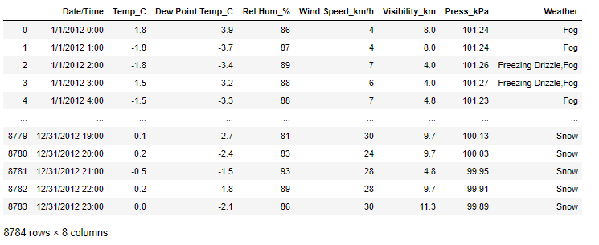
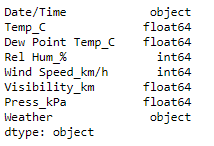

# Weather-Data-Analysis

## Language: Python
## Libraries: Pandas
## Dataset: Weather Dataset

### Dataset Explorations:

### Each Column Exploration

## The following analysis is made:

### Q1: Find all the unique "Wind Speed" values in the data

### Q2: Find the number of times when the 'Weather is exactly Clear'

### Q3: Find the number of times when the "Wind Speed was exactly 4 km/h"

### Q4: Find out all the Null values in the data

### Q6: What is the mean 'Visibilty' ?

### Q7: What is the Standard Deviation of 'Pressure' in this data?

### Q8: What is the variance of 'Relative Humidity' in this data?

### Q9: Find all instances when 'Snow' was recorded

### Q10: Find all instances when 'When Speed is above 24' and 'Visibility is 25'

### Q11: What is the Mean Value of each column against each 'Weather Condition'?

### Q12: What is the Minimum & Maximum value of each column against each 'Weather Condition'?

### Q13: Show all the Records where Weather Condition is Fog.

### Q14: Find all the instances when 'Weather is Crear' or 'Visibility is above 40'

### Q15: Find all instances when:
####a. 'Weather is Clear' and 'Relative Humidity is greater than 50' or b. 'Visibility is above 40'

 

 

